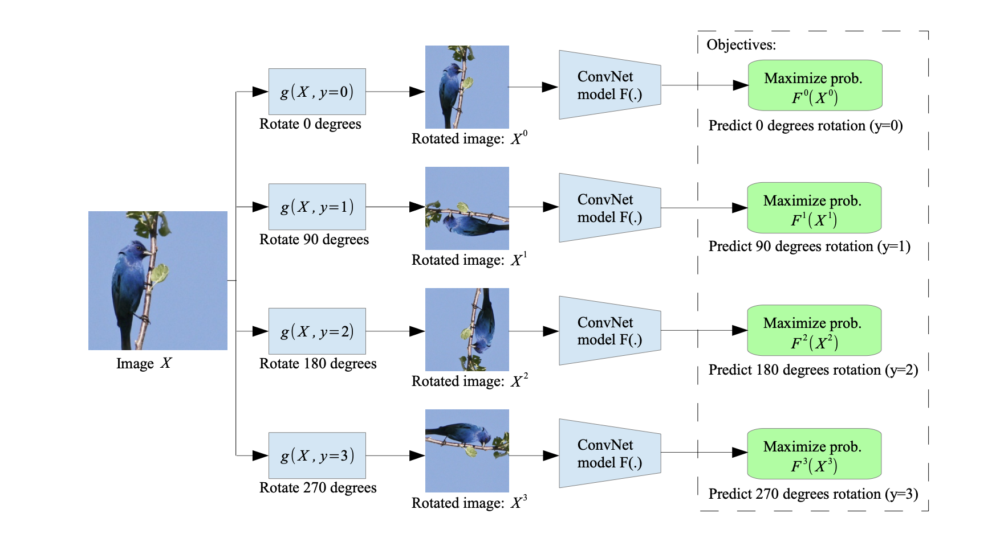

# Rotation Net on CIFAR-10

## Contents

1. [Highlights](#Highlights)

## Highlights

</img>

In this project, we will use PyTorch to train a ResNet-18 model on a self-supervised task, fine-tune a subset of the model’s weights, and train a model in a fully supervised setting with different weight initializations. We will be using the CIFAR10 dataset, which is a dataset of small (32x32) images belonging to 10 different object classes. For self-supervised training, we will ignore the provided labels; however, we will use the class labels for fine-tuning and fully supervised training.

The self-supervised training task is image rotation prediction, as proposed by [Gidaris](https://arxiv.org/pdf/1803.07728.pdf). For this task, all training images are randomly rotated by 0, 90, 180, or 270 degrees. The network is then trained to classify the rotation of each input image using cross-entropy loss by treating each of the 4 possible rotations as a class. This task can be treated as pre-training, and the pre-trained weights can then be fine-tuned on the supervised CIFAR10 classification task.

Results can be seen in the provided notebook.

